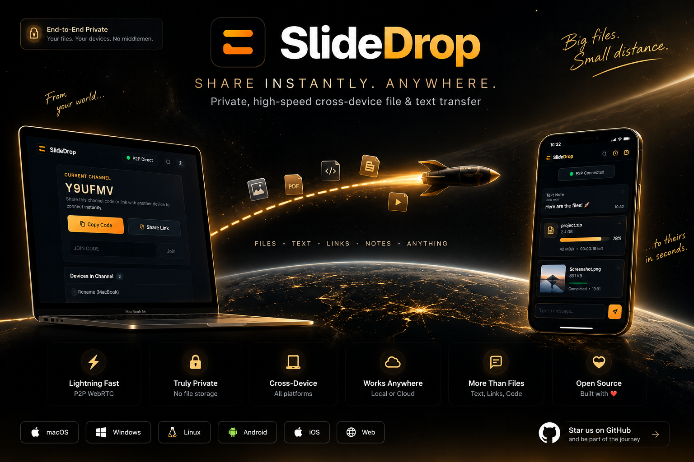
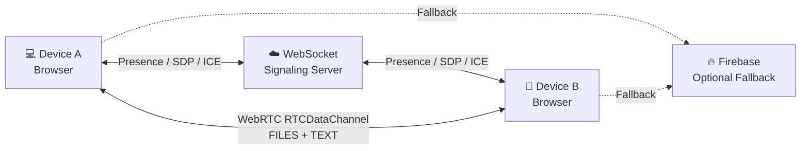

<div align="center">



# ⚡ SlideDrop

### **Private. Fast. Direct.**

**Cross-device file & text transfer built around WebRTC P2P, real-time WebSocket signaling, and optional cloud fallback.**

<p>


</p>

**Send a file. Pick a device. Watch it fly.**

</div>

---

## ◈ What is SlideDrop?

SlideDrop is a private browser-based transfer tool for moving files and text between your own devices without the friction of messaging apps, email attachments, or temporary upload sites.

Open SlideDrop → create a channel → join from another device → transfer.

```text
 ┌───────────────┐                              ┌───────────────┐
 │    MACBOOK    │                              │     PHONE     │
 │               │                              │               │
 │   project.zip │                              │   project.zip │
 └───────┬───────┘                              └───────▲───────┘
         │                                              │
         │             WEBRTC DATA CHANNEL             │
         └══════════════════════════════════════════════┘
                         DIRECT P2P

              WebSocket = coordination
              WebRTC    = actual transfer
              Firebase  = optional fallback
```

> **The signaling server helps devices find and negotiate with each other. When a direct WebRTC path is available, the actual transfer can travel directly between browsers.**

---

# ✦ Features

| | |
|---|---|
| ⚡ **Direct P2P** | Browser-to-browser transfer using WebRTC `RTCDataChannel`. |
| 🔒 **Private workflow** | Separate signaling/control plane from the P2P data path. |
| 🌍 **Cross-network ready** | WebRTC connectivity with optional Firebase cloud fallback. |
| 📡 **Real-time discovery** | Live channel membership, presence, and device discovery. |
| 📦 **Large-file transfer** | Chunking + backpressure instead of sending an entire file as one message. |
| 📝 **Text transfer** | Notes, links, snippets, code, and plain text. |
| 📱 **Cross-device** | Works from modern browsers across desktop and mobile platforms. |
| 🎬 **Live transfer scene** | Real progress, speed, ETA, source, destination, and transport state. |
| 🔄 **Recovery** | Reconnect logic, membership snapshots, peer recovery, and transfer acknowledgements. |

---

# 🚀 How it works

### 01 — Create a channel

SlideDrop generates a temporary channel code.

```text
CURRENT CHANNEL

      Y9UFMV

[ Copy Code ]   [ Share Link ]
```

### 02 — Join

Open SlideDrop on another device and enter the code or open the shared link.

### 03 — Discover

The signaling layer synchronizes the channel and establishes WebRTC negotiation.

### 04 — Transfer

Choose a file or send a text note.

```text
MacBook
   │
   │        ┌──────────────┐
   └───────►│   DATA       │────────► Phone
            │   FLIGHT     │
            └──────────────┘
                   ✦
                42 MB/s
```

### 05 — Receive

The destination acknowledges the transfer and the item appears in history.

---

# 🛰️ Architecture



### Control plane vs data plane

```text
CONTROL PLANE
────────────────────────────────────

 Device A ───── WebSocket ─────► Signaling
 Device B ───── WebSocket ─────► Signaling

          discovery
          presence
          SDP
          ICE


DATA PLANE
────────────────────────────────────

 Device A ═══════════════════════ Device B
                 WebRTC

          files
          text
          chunks
          progress
```

This separation is a core part of SlideDrop's architecture.

---

# 🧠 Tech Stack

| Layer | Technology | Purpose |
|---|---|---|
| Frontend | Next.js 16 | Application + UI |
| UI | React 19 | Interactive transfer experience |
| Language | TypeScript | Type-safe application/server code |
| Styling | CSS Modules | SlideDrop visual system |
| Signaling | Node.js + `ws` | Presence, rooms, discovery, SDP/ICE relay |
| Transport | WebRTC | Direct browser-to-browser connection |
| Data | `RTCDataChannel` | File and text transfer |
| Transfer engine | Custom TypeScript | Chunking, backpressure, progress, ACKs |
| Identity | Firebase Anonymous Auth | Lightweight backend identity |
| Metadata | Firestore | Transfer metadata / coordination |
| Fallback | Firebase Storage | Cloud relay when direct P2P is unavailable |
| Hosting | Render / Node-compatible hosting | Frontend + signaling |

---

# 📦 File Transfer Pipeline

Files are streamed in chunks rather than pushed through the DataChannel as one huge payload.

```text
                   FILE
                     │
                     ▼
              ┌─────────────┐
              │   CHUNKING  │
              └──────┬──────┘
                     │
          ┌──────────┼──────────┐
          ▼          ▼          ▼
        16 KB      16 KB      16 KB     ...
          │          │          │
          └──────────┼──────────┘
                     ▼
              RTCDataChannel
                     │
                 Backpressure
                     │
                     ▼
                  Receiver
                     │
               Chunk Assembly
                     │
                     ▼
              Completion ACK
                     │
                     ▼
                  FILE
```

This enables live:

- percentage
- bytes transferred
- speed
- remaining time
- completion state

---

# 🌐 Direct P2P vs Cloud Fallback

### 🟠 Direct P2P

```text
DEVICE A ═════════════════ DEVICE B
                WebRTC
```

When WebRTC establishes a usable direct path, the file transfer uses the P2P DataChannel.

### ☁️ Cloud fallback

```text
DEVICE A ─────► FIREBASE STORAGE ─────► DEVICE B
```

When direct connectivity is unavailable and fallback is configured, SlideDrop can use Firebase Storage as the application-level relay.

The UI should reflect the transport actually used.

---

# 🔐 Identity & Channels

SlideDrop does not use a device name as a peer identity.

Conceptually:

```text
Device Name
    │
    └── human-readable label

Device ID
    │
    └── persistent identity

Channel Code
    │
    └── temporary room/session
```

This allows a device to rename itself without destroying its connection identity.

---

# 🔄 Reliability

Browser connections can disappear. SlideDrop is designed around reconnectable sessions rather than assuming a WebSocket will stay alive forever.

```text
CONNECTED
    │
    ▼
NETWORK INTERRUPTION
    │
    ▼
RECONNECTING
    │
    ├── retry
    ├── retry
    ├── retry
    │
    ▼
CONNECTED
    │
    ▼
RESTORE CHANNEL
    │
    ▼
RESTORE PEERS
```

The signaling architecture includes:

- persistent device identity
- explicit join acknowledgement
- authoritative membership snapshots
- membership revisions
- stale socket protection
- heartbeat / keepalive
- reconnect backoff
- per-peer WebRTC recovery
- clean leave propagation
- receiver acknowledgements

---

# 🎬 The Transfer Experience

SlideDrop is intentionally more visual than a traditional upload component.

Instead of:

```text
Uploading...
████████████░░░░ 78%
```

the transfer becomes a small visual journey:

```text
             ✦
SOURCE ────────► TRANSFER ────────► DESTINATION
  ◉                                  ◉
MacBook                            Phone

                  78%
              42 MB/s
```

### Sending

**LAUNCH**

Files gather at the source, enter the transfer capsule, travel along the trajectory, and arrive at the destination.

### Receiving

**CAPTURE**

Incoming data approaches the destination, activates a subtle capture field, and is absorbed into the receiving device.

The animation follows the real transfer state rather than pretending that a file was sent.

---

# 📁 Project Structure

```text
SlideDrop/
│
├── src/
│   ├── app/
│   │   ├── page.tsx
│   │   ├── page.module.css
│   │   └── layout.tsx
│   │
│   └── lib/
│       ├── signaling-client.ts
│       ├── webrtc.ts
│       ├── transfer-manager.ts
│       ├── firebase.ts
│       └── types.ts
│
├── signaling-server/
│   ├── src/
│   │   ├── server.ts
│   │   └── test-e2e.ts
│   ├── package.json
│   └── tsconfig.json
│
├── docs/
│   └── slidedrop-transfer.png
│
├── .env.example
├── package.json
└── README.md
```

---

# ⚙️ Getting Started

## Prerequisites

- Node.js **20+**
- npm **10+**
- Git

## 1. Clone

```bash
git clone https://github.com/d-ghosh717/SlideDrop.git
cd SlideDrop
```

## 2. Install dependencies

```bash
npm install

cd signaling-server
npm install
cd ..
```

## 3. Environment

```bash
cp .env.example .env.local
```

Example configuration:

```env
NEXT_PUBLIC_SIGNALING_URL=wss://your-signaling-server.example.com

NEXT_PUBLIC_FIREBASE_API_KEY="your-api-key"
NEXT_PUBLIC_FIREBASE_AUTH_DOMAIN="your-project.firebaseapp.com"
NEXT_PUBLIC_FIREBASE_PROJECT_ID="your-project-id"
NEXT_PUBLIC_FIREBASE_STORAGE_BUCKET="your-project.appspot.com"
NEXT_PUBLIC_FIREBASE_MESSAGING_SENDER_ID="your-sender-id"
NEXT_PUBLIC_FIREBASE_APP_ID="your-app-id"
NEXT_PUBLIC_FIREBASE_DATABASE_URL="https://your-project-default-rtdb.firebaseio.com"

FIREBASE_CLIENT_EMAIL=
FIREBASE_PRIVATE_KEY=
CRON_SECRET=
```

Firebase is optional for the core WebRTC + signaling flow.

> **Never commit `.env`, `.env.local`, Firebase service-account files, private keys, or other secrets.**

---

# 🧪 Development

## Full stack

```bash
npm run dev:all
```

Runs:

```text
Next.js       → http://0.0.0.0:3000
Signaling     → ws://0.0.0.0:3001
```

## Separately

Terminal 1:

```bash
npm run server
```

Terminal 2:

```bash
npm run dev -- -H 0.0.0.0
```

## Browser-only

```bash
npm run dev
```

Open:

```text
http://localhost:3000
```

---

# 📱 Test With Physical Devices

Start the full stack:

```bash
npm run dev:all
```

Find the host machine's LAN IP.

### macOS / Linux

```bash
ifconfig
```

### Windows

```powershell
ipconfig
```

Then open SlideDrop from the second device using:

```text
http://YOUR_LAN_IP:3000
```

Example:

```text
http://192.168.1.50:3000
```

or:

```text
http://10.64.35.86:3000
```

Then:

1. Create a channel on Device A.
2. Copy the channel code.
3. Join from Device B.
4. Wait for discovery.
5. Select a file.
6. Transfer.

> `localhost` always refers to the device you're currently using. A second physical device must use the host machine's LAN address.

---

# 🧪 Production Build

```bash
npm run server:build
npm run build
```

Start:

```bash
npm run start
```

and:

```bash
npm run server:start
```

---

# 🧰 Scripts

```bash
npm run dev
npm run dev:all

npm run server
npm run server:build
npm run server:start

npm run build

npm --prefix signaling-server test
```

---

# 🚢 Deployment

SlideDrop has two main deployable pieces:

```text
                         INTERNET
                            │
             ┌──────────────┴──────────────┐
             ▼                             ▼
       NEXT.JS FRONTEND              WEBSOCKET SERVER
             │                             │
             └──────────────┬──────────────┘
                            ▼
                       WEBRTC P2P
                            │
                    DEVICE ↔ DEVICE
```

### Frontend

Deploy the Next.js application to a Node-compatible host.

Configure:

```env
NEXT_PUBLIC_SIGNALING_URL=wss://your-signaling-server.example.com
```

### Signaling server

Deploy `signaling-server/` as a Node.js WebSocket service.

The service should:

- listen on the platform-provided `PORT`
- bind publicly to `0.0.0.0`
- expose a health endpoint
- support long-lived WebSocket connections
- implement heartbeat and reconnect-safe signaling

---

# 🧪 Reliability Test Matrix

| Scenario | Expected behavior |
|---|---|
| 2 devices join | Both discover each other |
| 4 devices join | Authoritative membership stays synchronized |
| Member leaves | Remaining members update immediately |
| Browser refresh | Device identity survives |
| Temporary network loss | Client reconnects |
| Signaling restart | Client recovers without manual reload |
| Invalid code | Clear error |
| Simultaneous joins | No accidental duplicate membership |
| Rename device | Device stays in channel |
| P2P transfer | Direct WebRTC path used when available |
| P2P failure | Configured fallback can be used |
| Transfer interrupted | No false completion |
| Receiver ACK | Sender marks transfer complete |
| Successful transfer | Animation closes automatically |
| Mobile browser | No horizontal overflow |

---

# 🗺️ Roadmap

- [x] Temporary channel codes
- [x] Share links
- [x] Device discovery
- [x] WebSocket signaling
- [x] WebRTC P2P transfer
- [x] Chunked file transfer
- [x] Backpressure handling
- [x] Text transfer
- [x] Live transfer progress
- [x] Responsive UI
- [x] Automatic reconnect
- [x] Rename without leaving channel
- [x] Cinematic transfer animations
- [x] P2P / fallback transport architecture
- [ ] TURN infrastructure for broader NAT compatibility
- [ ] Resumable interrupted large-file transfers
- [ ] PWA / installable experience
- [ ] Transfer queue improvements
- [ ] Additional integrity verification

---

# ⚠️ Security Notes

For production deployments:

- use HTTPS/WSS
- protect server-side Firebase credentials
- never commit secrets
- validate channel codes server-side
- use immutable device IDs for peer identity
- treat channel codes as temporary capabilities
- configure restrictive Firebase Storage rules
- consider TURN and additional transport hardening for difficult networks

---

# 🤝 Contributing

```bash
git checkout -b feature/my-feature
git add .
git commit -m "Add my feature"
git push origin feature/my-feature
```

Then open a pull request.

---

<div align="center">

# ⚡ SlideDrop

### **Move your files. Not your patience.**

`PRIVATE` • `DIRECT` • `CROSS-DEVICE` • `FAST`

<br>

<a href="https://github.com/d-ghosh717/SlideDrop">
  
</a>

</div>
